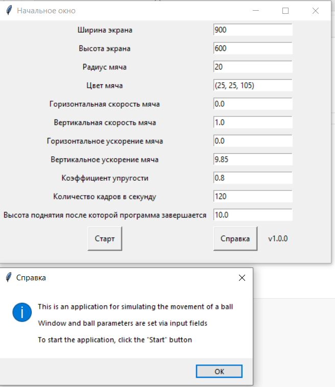
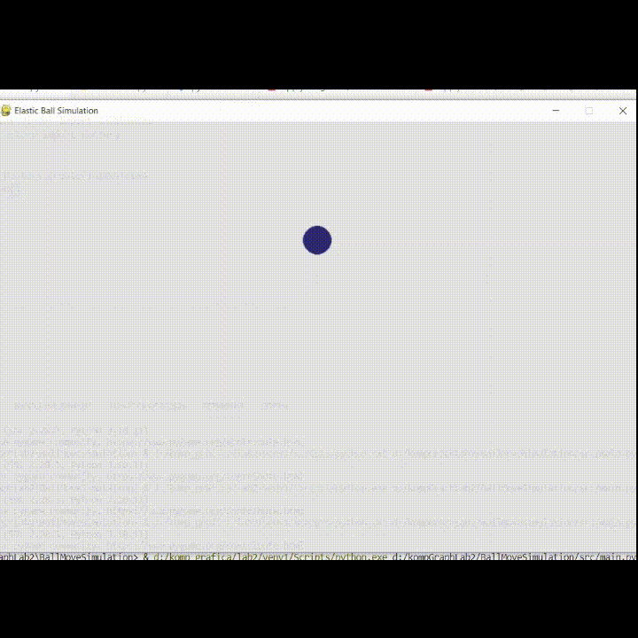

[](https://github.com/RailSafiullin/BallMoveSimulation/actions/workflows/app.yml)
[](https://opensource.org/licenses/Apache-2.0)
# Лабораторная работа по дисциплине "Компьютерная графика" №2

## Content

- [Preview](#preview)

- [How to install](#how-to-install-and-start)

- [Task 3](#task-3)

-   [License](#license)


## Preview

Application for simulating the motion of an elastic ball with specified physical parameters

Image of the application's initial window



Ball movement animation



## How to install and start

```cmd

git clone https://github.com/RailSafiullin/BallMoveSimulation
cd BallMoveSimulation
pip install pytest
pip install pygame
python main.py

```

## Task 3

Требуется составить программу, которая демонстрирует процесс падения упругого шарика с заданной высоты на абсолютно твердую горизонтальную плоскость с последующими отражениями. Коэффициент отражения равен k. Программа должна завершаться по нажатию клавиши ESC или когда высота поднятия отскакивающего шарика станет меньше заданной величины h

## License

Distributed under the Apache License 2.0. See LICENSE.txt for more information.


